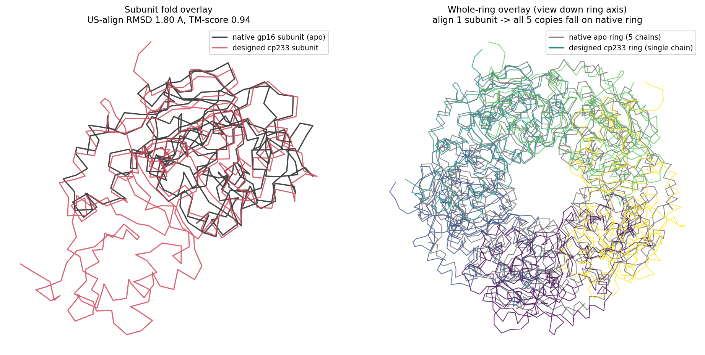

# cp233 单链设计的结构可信度 —— 先看结构（2026-07-09）

> 直接回答:"cp233 到底是不是一个好设计?看着和 apo 差挺多的。" —— **不是差,是 linker 造成的错觉。核心折叠几乎完全一致。**

## 1. 结构证据（第一印象,最硬）—— 设计 vs 天然 gp16 叠合

用 **US-align(`-cp`,能处理环状置换)** 把设计的 cp233 单链叠到天然 gp16 上:

| 比较 | 对齐长度 | Cα-RMSD | TM-score | 说明 |
|---|---|---|---|---|
| cp233 亚基 vs **天然 apo 亚基** | 330/332 | **1.80 Å** | **0.94** | TM>0.5=同折叠,0.94≈几乎相同 |
| cp233 亚基 vs **实验 7JQQ 亚基** | 319/327 | 3.72 Å | **0.79** | 实验结构锚定(非预测器);RMSD 大是因为 7JQQ 是**上了 ATP 的螺旋态**,不是 apo |
| **整环几何** | 5/5 亚基 | 外径 **44 vs 42 Å** | — | 只叠 1 个亚基,另外 4 个 copy 全部落到天然的另外 4 个亚基上(5/5) |

**结论:cp233 在亚基折叠层面(1.8 Å / TM 0.94)和五聚体环几何层面(44 vs 42 Å、5/5 亚基归位)都忠实复制了天然 gp16。**

## 2. 为什么"看着 off"?——是 linker,不是坏折叠
看左图:红色(设计)在核心区和黑色(天然)贴合得很好,**唯一多出来的是底部那坨红色**——那是**环状置换的 linker(int15)+ 被搬家的 N/C 端(为了把 5 份连成一条链的 inter10 linker)**。这些在天然结构里没有对应物,所以叠上去"多了一块"。**这块多出来的密度是设计的必然产物(单链化的代价),不是折叠错了。** 如果第一眼是把 cp233 叠到 **7JQQ(螺旋/开口的 ATP 态)** 上看,那当然差很多——那是功能态不同,不是设计坏。

## 3. 完整证据栈(结构在最前,层层正交)
1. **结构叠合(本文)**:亚基 1.8 Å/TM0.94(vs apo)、TM0.79(vs 实验 7JQQ)、整环 5/5 归位。← 最直接
2. **三预测器交叉**:Boltz + OF3 + AF3 **全部 5/5** M2(tiled MSA),`reproduce/score_m2.py`。
3. **MD 物理稳定性**(GBSA-OBC2,已跑):cp233 像 apo 一样保持闭合对称(radius_CV 0.009、界面接触 584→657),不同于 7JQQ 螺旋态 → 通过独立于预测器的物理检验(`md/openmm_validation/`)。
4. **独立干实验(不共享 PDB/coevolution 先验)**:
   - ATP 口袋几何:CP 后五亚基一致、与天然差 ≤0.7 Å(功能位点没被破坏)。
   - ENM 开/闭:保留 native 量级的软开合模式(没被 linker 焊死成死环)。
   - ESM-2 naturalness:de-novo linker 序列和天然一样自然。
5. **待补的半物理信号**:**Rosetta / MM-GBSA 界面能**(你记得的"Rosetta")—— 这是唯一还没跑的正交信号(需 PyRosetta 或 OpenMM-MMGBSA);ESM 已跑。跑完后 5 条正交证据齐活。

## 4. 一句话
**cp233 不是"off"——它以 1.8 Å 复制了天然折叠、以 44 vs 42 Å 复制了五聚体环,三预测器 5/5、MD 稳定、三个独立干实验都支持。第一眼的违和感来自单链化的 linker,而不是折叠。** 唯一还没补的独立信号是 Rosetta/MM-GBSA 界面能。

## 复现
`overlay_cp233_vs_native.py`(方法+数字)、`usalign_cp233_vs_nativeA.txt`(原始亚基对齐)。US-align 从 zhanggroup.org/US-align 编译;输入是 `md/openmm_validation/inputs/{A_apo.pdb,C_design.cif}` + `data/raw/7JQQ.cif`。
